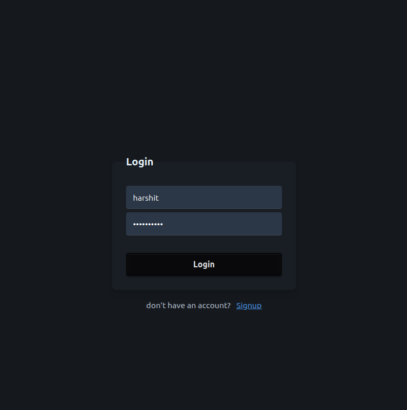
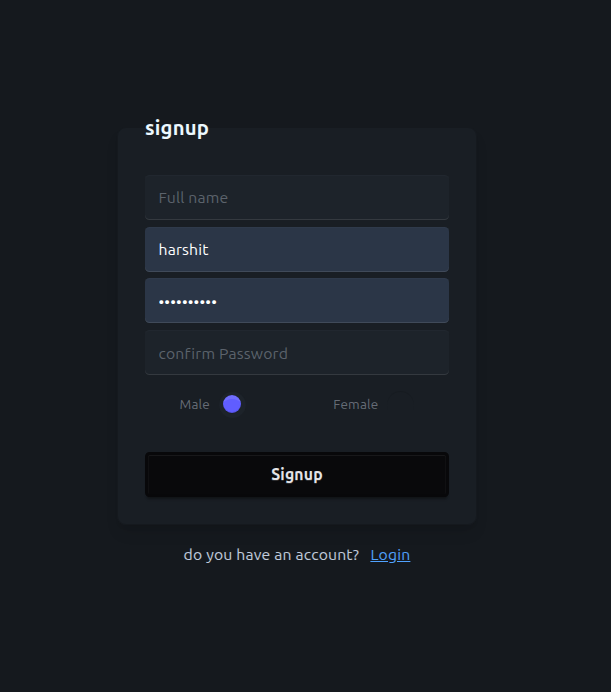
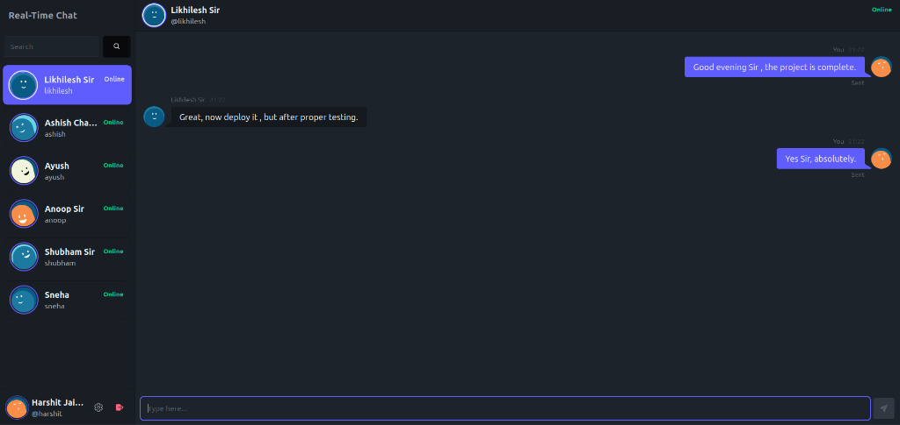
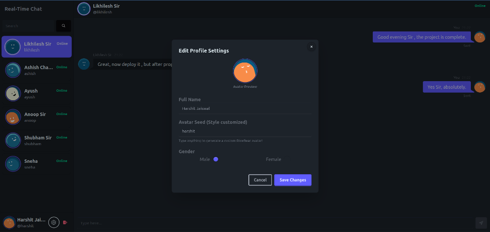

<h1 align="center">💬 Real-Time Chat Application</h1>

<p align="center">
  A premium full-stack real-time chat app built with React, Express, MongoDB & Socket.io
</p>

<p align="center">
  <a href="https://client-eta-vert.vercel.app" target="_blank">
    
  </a>
  
  
  
  
</p>

---

## 🌐 Live Demo

| Service | URL |
|---------|-----|
| 🖥️ Frontend | [https://client-eta-vert.vercel.app](https://client-eta-vert.vercel.app) |
| ⚙️ Backend API | [https://server-three-tau-86.vercel.app](https://server-three-tau-86.vercel.app) |
| 📦 GitHub Repo | [https://github.com/harshitj183/realtime-chat-app](https://github.com/harshitj183/realtime-chat-app) |

---

## 📸 Screenshots

<table>
  <tr>
    <td align="center" width="50%">
      
      <br/>
      <b>🔐 Login Page</b>
    </td>
    <td align="center" width="50%">
      
      <br/>
      <b>📝 Signup Page</b>
    </td>
  </tr>
  <tr>
    <td align="center" width="50%">
      
      <br/>
      <b>💬 Main Chat Interface</b>
    </td>
    <td align="center" width="50%">
      
      <br/>
      <b>👤 Edit Profile Modal</b>
    </td>
  </tr>
</table>

---

## ✨ Features

- ⚡ **Real-Time Messaging** — Instant delivery using Socket.io WebSockets
- 🟢 **Online Status** — Live green indicator dots for online users
- 🎨 **Custom Avatars** — DiceBear avatar styles with real-time preview
- 📱 **Responsive UI** — TailwindCSS + DaisyUI dark theme
- ⌨️ **Enter-to-Send** — Smooth UX for fast messaging
- 🔔 **Sound Notifications** — Subtle chime on new messages
- 🔐 **JWT Authentication** — Secure login & protected routes

---

## 🛠️ Tech Stack

| Layer | Technologies |
|-------|-------------|
| **Frontend** | React 19, Redux Toolkit, React Router, TailwindCSS, DaisyUI |
| **Backend** | Node.js, Express 5, Socket.io |
| **Database** | MongoDB Atlas, Mongoose |
| **Auth** | JWT, bcryptjs, Cookie-parser |
| **Deployment** | Vercel (Frontend + Backend) |

---

## 🚀 Local Setup

### Prerequisites
- Node.js v18+
- MongoDB Atlas URI

### 1. Clone the repo

```bash
git clone https://github.com/harshitj183/realtime-chat-app.git
cd realtime-chat-app
```

### 2. Server Setup

```bash
cd server
npm install
```

Create `.env` in `server/` folder:

```env
MONGO_DB=your_mongodb_connection_uri
JWT_SECRET=your_jwt_secret_key
JWT_EXPIRE=2d
PORT=5000
CLIENT_URL=http://localhost:5173
```

```bash
npm run dev
```

### 3. Client Setup

```bash
cd client
npm install
```

Create `.env` in `client/` folder:

```env
VITE_API_URL=http://localhost:5000/api/v1
```

```bash
npm run dev
```

Open [http://localhost:5173](http://localhost:5173) 🎉

---

## 📁 Project Structure

```
realtime-chat-app/
├── client/                 # React frontend
│   ├── src/
│   │   ├── components/     # Reusable components
│   │   ├── pages/          # Auth & Home pages
│   │   ├── store/          # Redux slices & thunks
│   │   └── main.jsx
│   └── vercel.json
├── server/                 # Express backend
│   ├── controllers/        # Route handlers
│   ├── models/             # Mongoose models
│   ├── routes/             # API routes
│   ├── socket/             # Socket.io setup
│   ├── middlewares/        # Auth & error handlers
│   └── vercel.json
└── README.md
```

---

<p align="center">Made with ❤️ by <a href="https://github.com/harshitj183">harshitj183</a></p>
